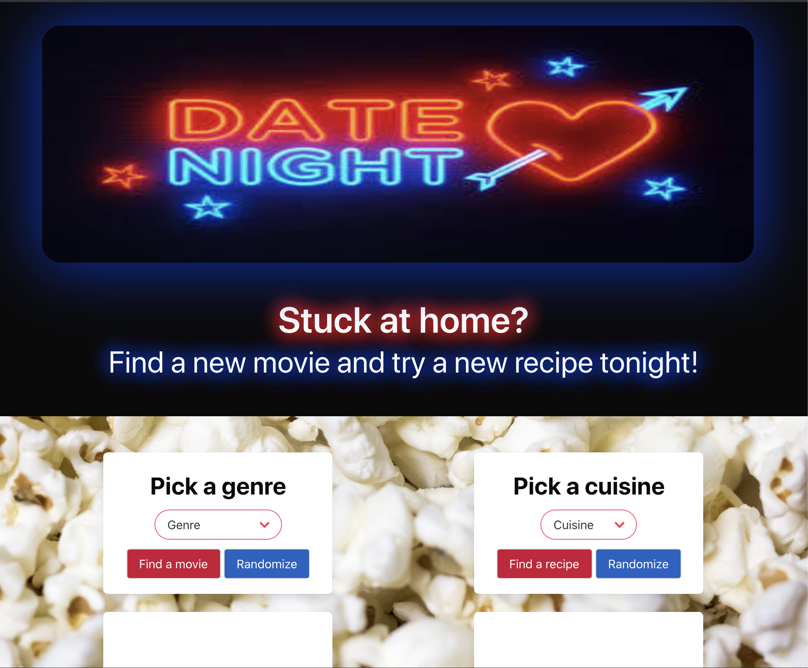

# datenight

This is a homework assignment for Case Western Reserve University Coding Bootcamp. This is our first group project in class and the purpose is to work in groups of 4-5 people and build a website using certain criteria. 

Our website is called Date Night and the purpose of our site is for a couple, who is stuck at home, to find a new movie to watch and a new recipe to make and have a date night at home. 

Links to websites:

https://github.com/michellew179/datenight/

https://michellew179.github.io/datenight/

Screenshot of website:

Created using the following:

The Movie DB: https://www.themoviedb.org/documentation/api

Spoonacular: https://spoonacular.com/food-api

Bulma: https://bulma.io/

Contributors:

https://github.com/tedkkraft
https://github.com/michellew179
https://github.com/jkoby24
https://github.com/alexfuss
https://github.com/LITTY86

